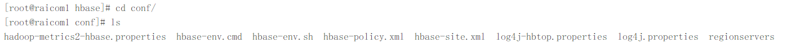
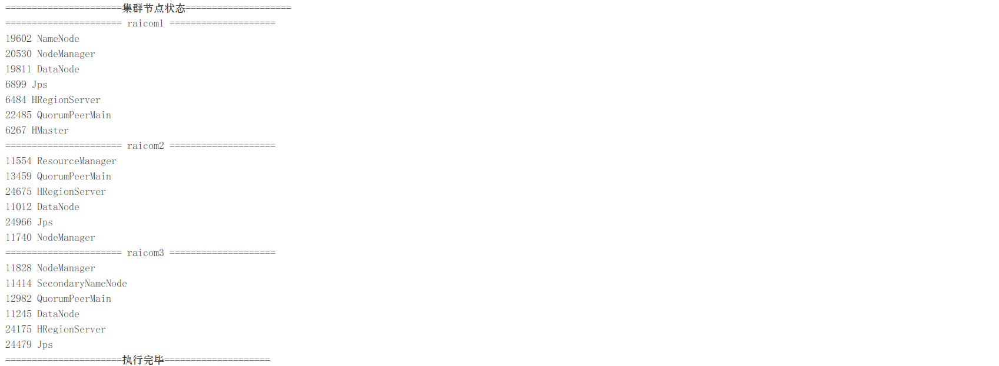
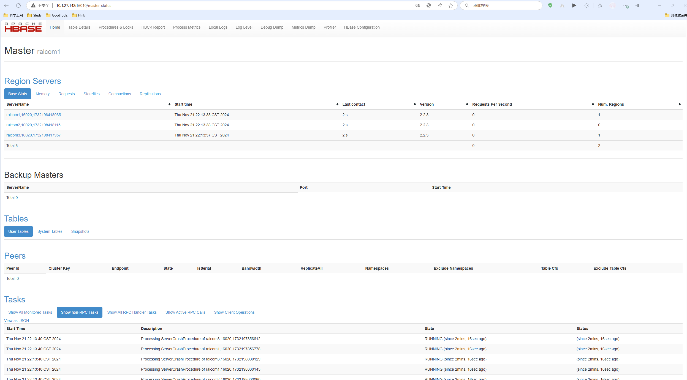

#### raicom-Hbase分布式部署

---

##### 前置环境

- Linux-CentOS7操作系统 -- raicom1（10.1.27.142）
- Linux-CentOS7操作系统 -- raicom2（10.1.27.144）
- Linux-CentOS7操作系统 -- raicom3（10.1.27.146）
- SSH远程连接工具 -- FinalShell
- Java环境 -- jdk1.8_341
- hadoop分布式集群
- zookeeper分布式集群
- hbase2.2.3软件包

##### 1.1基础文件配置

进入hbase软件包根目录中，然后进入到`./conf`目录中：



###### 1.1.1 hbase-env.sh文件

编辑hbase-env.sh文件，添加以下内容后保存退出:

```properties 
export JAVA_HOME=/opt/module/jdk
export HBASE_HOME=/opt/module/hbase
export HADOOP_HOME=/opt/module/hadoop
```

###### 1.1.2 hbase-site.xml文件

编辑hbase-site.xml文件，在<configuration></configuration>标签中间添加以下内容：

```xml
	<property>
		<name>hbase.cluster.distributed</name>
		<value>true</value>
	</property>
	<property>
        <name>zookeeper.znode.parent</name>
        <value>/hbase</value>
    </property>
	<property>
		<name>hbase.tmp.dir</name>
		<value>./tmp</value>
	</property>
	<property>
		<name>hbase.unsafe.stream.capability.enforce</name>
		<value>false</value>
	</property>
	<!--hbase的数据保存在hdfs-->
	<property>
		<name>hbase.rootdir</name>
		<value>hdfs://raicom1:9000/hbase</value>
	</property>
	<!--配置ZK的地址-->
	<property>
		<name>hbase.zookeeper.quorum</name>
		<value>raicom1:2181,raicom2:2181,raicom3:2181</value>
	</property>
	<!--zookeeper数据目录-->
	<property>
		<name>hbase.zookeeper.property.dataDir</name>
		<value>/root/hbase/zookeeper</value>
	</property>
	<!--主节点和从节点的最大时间误差-->
	<property>
		<name>hbase.master.maxclockskew</name>
		<value>18000</value>
	</property>
```

###### 1.1.3 regionservers文件

去掉localhost，添加以下内容：

> raicom1
> raicom2
> raicom3

###### 1.1.4 分发配置文件

> scp -r /opt/module/hbase/conf/ root@raicom2:/opt/module/hbase/
>
> scp -r /opt/module/hbase/conf/ root@raicom3:/opt/module/hbase/

##### 1.2 启动Hbase集群

在启动hbase集群之前需要提前启动hadoop和zookeeper，然后才能正常启动hbase：

>zkServer.sh start  (三台执行)
>
>start-dfs.sh
>
>raicom2:start-yarn.sh
>
>start-hbase.sh

启动后控制台无报错信息并且jps节点信息如下所示则为启动成功



##### 1.3 web端查看

浏览器访问10.1.27.142:16010出现以下界面：



---

**Hbase分布式集群部署完毕！**

