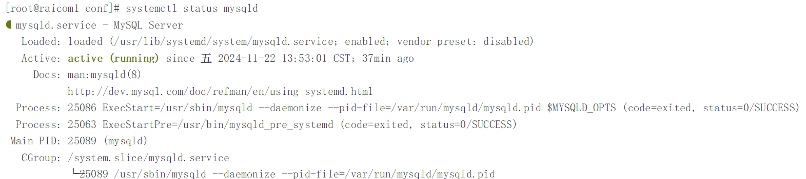
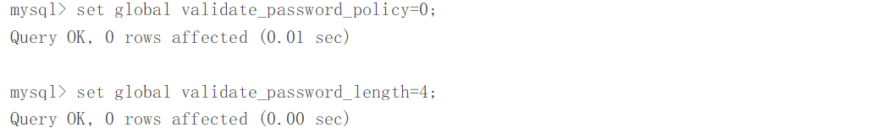
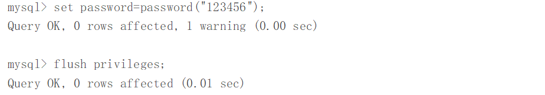
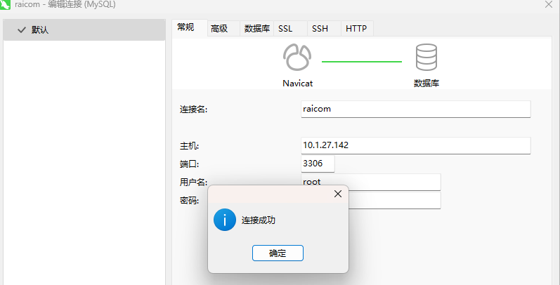
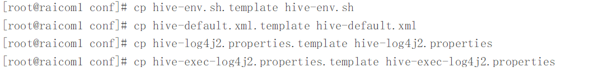
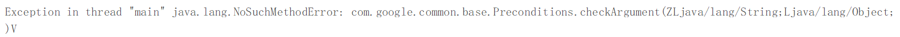
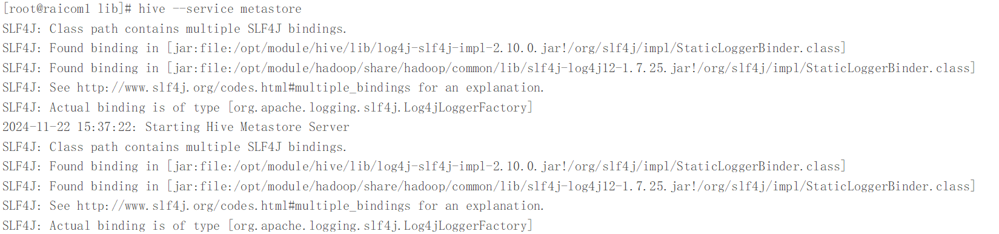
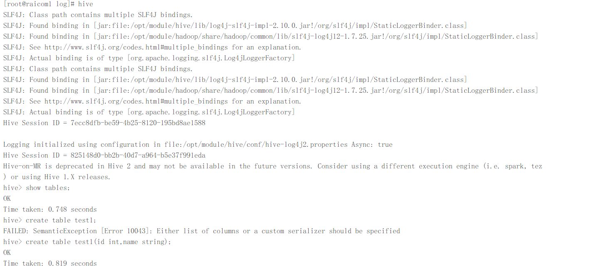
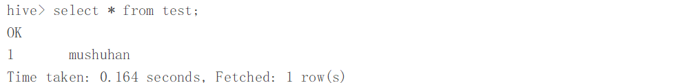
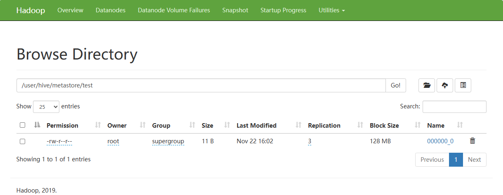

#### Hive数仓部署

---

##### 前置环境

- Linux-CentOS7操作系统 -- raicom1（10.1.27.142）
- Linux-CentOS7操作系统 -- raicom2（10.1.27.144）
- Linux-CentOS7操作系统 -- raicom3（10.1.27.146）
- SSH远程连接工具 -- FinalShell
- Java环境 -- jdk1.8_341
- hadoop分布式集群
- MySQL5.7.43
- Hive3.1.2软件包

##### 1.1 Hive外部配置(MySQL)

###### 1.1.1 启动mysqld

如果是新部署的MySQL服务则需要简单配置，首先需要启动mysqld并设置开机自启动：

> systemctl start mysqld
>
> systemctl enabled mysqld



###### 1.1.2 查看初始密码

MySQL在初次部署并启动时，会生成一个随机密码，可以在/var/log/mysqld.log中查看：

> [!CAUTION]
>
> ***注：如果没有启动mysqld服务，则不会生成随机初始密码，mysqld.log中也是空内容***


###### 1.1.3 更改初始密码

初次登陆使用初始随机密码登录：

> mysql -uroot -pvE%DdFQzq0*#

登陆后由于是初次登陆的原因不能进行表操作或库操作等基础操作，需要更改初始密码，如果只是在测试环境的情况下可以设置较为简单的密码，**但是需要降低mysql的密码策略：**

> set global validate_password_policy=0;
> set global validate_password_length=4;



降低密码策略后设置密码为123456，后刷新服务器配置：

> set password=password("123456");
>
>  flush privileges;



> [!CAUTION]
>
> ***注：不同版本的MySQL降低密码策略的命令不同，我的是mysql5.7.43***

###### 1.1.4 mysql允许远程登录

> use mysql
>
> select user, host from user;
>
> update user set host="%" where user="root";
>
> flush privileges;

执行成功以上命令后退出MySQL客户端，然后重启mysqld：

> systemctl restart mysqld



**Navicat测试连接成功！**

###### 1.1.5 Hive on MySQL

希望将hive的元数据写入到MySQL的metastore数据库，但是MySQL默认没有metastore数据库，需要提前创建：

> \#登录MySQL 
>
> mysql -uroot -p123456
>
>  #创建Hive元数据库 
>
> mysql> create database metastore; 
>
> mysql> quit;

**将MySQL的JDBC驱动拷贝到Hive的lib目录下**

> cp ../package/mysql/mysql-connector-java-5.1.33.jar /opt/module/hive/lib/

##### 1.2 Hive文件相关配置

###### 1.2.1 模板文件拷贝

首先要进入hive软件根目录，然后进入`./conf`配置文件目录中：

> cd /opt/module/hive/conf

Hive的配置文件默认都被命名为了模板文件，需要对其进行拷贝重命名之后才能使用:

> cp hive-env.sh.template hive-env.sh
> cp hive-default.xml.template hive-default.xml
> cp hive-log4j2.properties.template hive-log4j2.properties
> cp hive-exec-log4j2.properties.template hive-exec-log4j2.properties



###### 1.2.2 hive-env.sh文件

打开hive-env.sh文件编辑添加以下内容后保存退出：

> HADOOP_HOME=/opt/module/hadoop
>
> export HIVE_AUX_JARS_PATH=/opt/module/hive/lib
>
> export HIVE_CONF_DIR=/opt/module/hive/conf

###### 1.2.3 hive-site.xml文件

由于hive的conf目录下并没有hive-site.xml需要手动创建并编写文件内容：

> touch hive-site.xml
>
> vi hive-site.xml

创建完成后打开文件开始编写配置：

> [!CAUTION]
>
> **因为是xml文件，因此必须在头部声明以下内容：**
>
> <?xml version="1.0"?>
> <?xml-stylesheet type="text/xsl" href="configuration.xsl"?>
>
> ***注：可以去hadoop的配置目录下copy xml文件的头部声明信息***

```xml
<?xml version="1.0"?>
<?xml-stylesheet type="text/xsl" href="configuration.xsl"?>
<configuration>
	<!--jdbc连接的url-->
	<property>
		<name>javax.jdo.option.ConnectionURL</name>
		<value>jdbc:mysql://raicom1:3306/metastore?useSSL=false</value>
	</property>
	<!--jdbc连接的driverName-->
	<property>
		<name>javax.jdo.option.ConnectionDriverName</name>
		<value>com.mysql.cj.jdbc.Driver</value>
	</property>
	<!--jdbc连接的用户名-->
	<property>
		<name>javax.jdo.option.ConnectionUserName</name>
		<value>root</value>
	</property>
	<!--jdbc连接的密码-->
	<property>
		<name>javax.jdo.option.ConnectionPassword</name>
		<value>123456</value>
	</property>
	<property>
		<name>hive.metastore.warehouse.dir</name>
		<value>/user/hive/metastore</value>
	</property>
	<property>
		<name>hive.metastore.uris</name>
		<value>thrift://raicom1:9083</value>
	</property>
</configuration>
```

##### 1.3 启动hive

上述配置文件配置完毕后，现在开始启动hive

###### 1.3.1 初始化Hive元数据库

初始化的Hive源数据库采用MySQL来存储元数据

> bin/schematool -dbType mysql -initSchema -verbose

控制台无报错信息后，可以查看MySQL中的metastore数据库中是否注册了hive的元数据，查看数据库表如图表示初始化成功：

> mysql -uroot -p123456
>
> use metastore
>
> show tables;
>
> quit;


> [!NOTE]
>
> 如果在初始化源数据库时报错：
>
> 
>
> 这类错误一般两种思考思路：
>
> - **系统找不到相关jar包**
> - **同一类型的 jar 包有不同版本存在，系统无法决定使用哪一个**
>
> Hadoop和hive中都有guava.jar这个jar的存储，由此可以知道属于第二种情况，不同版本的jar包相互冲突，我们选择删除hive中低版本的guava-19.0.jar包，将hadoop中的guava-27.0-jre.jar复制到hive的lib目录下即可
>
> >cd /opt/module/hive/lib/
> >rm -rf guava-19.0.jar 
> >cp /opt/module/hadoop/share/hadoop/common/lib/guava-27.0-jre.jar .

###### 1.3.2 启动并使用Hive

上述步骤完成后开始就可以启动并使用hive了，首先要启动hive的元数据服务：

> hive --service metastore



> [!NOTE]
>
> 元数据服务会单独占用一个窗口，可以使用后台启动命令：
>
> > nohup hive --service metastore &
>
> 这样就不会单独占用窗口，日志信息输出在启动时的当前目录的nohup.out文件中

启动成功后使用：

> hive

进入客户端命令行界面，可以进行简单的SQL语句的测试：



> 简单SQL语句示例：
>
> create table test(id int,name string);
>
> insert into test(id,name) values(1,'mushuhan');
>
> select * from test;



同时可以查看到HDFS上的数据存储信息：



---

**Hive部署完毕！**
