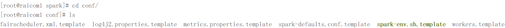
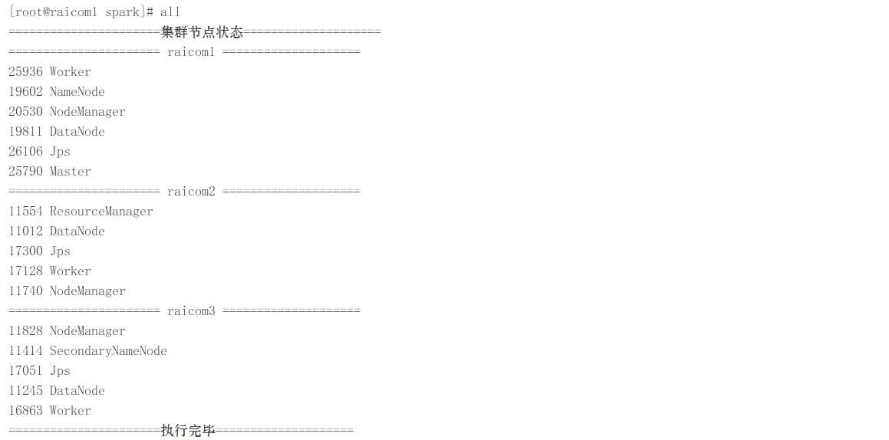
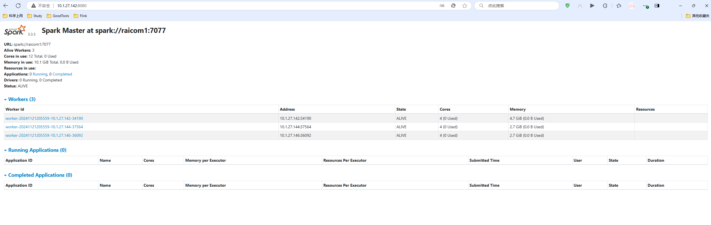

##### raicom-Spark On Yarn部署

---

###### 前置环境

- Linux-CentOS7操作系统 -- raicom1（10.1.27.142）
- Linux-CentOS7操作系统 -- raicom2（10.1.27.144）
- Linux-CentOS7操作系统 -- raicom3（10.1.27.146）
- SSH远程连接工具 -- FinalShell
- Java环境 -- jdk1.8_341
- hadoop分布式集群
- Spark3.3.3软件包

###### 1.1 spark-env.sh文件

进入Spark软件包根目录中，然后进入到`./conf`目录中：



复制文件spark-env.sh.template并改名为spark-env.sh后，开始编辑配置：

> cp spark-env.sh.template spark-env.sh
>
> vi spark-env.sh

**添加以下内容：**

```properties
export JAVA_HOME=/opt/module/jdk
export HADOOP_HOME=/opt/module/hadoop
export HADOOP_CONF_DIR=/opt/module/hadoop/etc/hadoop
export SPARK_CONF_DIR=/opt/module/spark/conf
export YARN_CONF_DIR=/opt/module/hadoop/etc/hadoop
```

###### 1.2 workers文件

复制文件spark-env.sh.template并改名为spark-env.sh后，开始编辑配置：

> cp workers.template workers
>
> vi workers

**去掉localhost，添加以下内容：**

> raicom1
> raicom2
> raicom3

###### 1.3 分发配置文件

> scp -r /opt/module/spark/conf/ root@raicom2:/opt/module/spark/
>
> scp -r /opt/module/spark/conf/ root@raicom3:/opt/module/spark/

###### 1.4 启动Spark

以上文件配置完成之后，开始启动Spark，启动命令如下：

> [!CAUTION]
>
> 因为spark的启动命令start-all.sh和Hadoop的统一启动命令有冲撞，因此我们进入Spark的sbin目录中启动Spark

> start-all.sh

启动后控制台无报错信息并且jps节点信息如下所示则为启动成功



###### 1.5 web端查看

浏览器访问10.1.27.142:8080出现以下界面：



---

**Spark分布式集群部署完毕！**