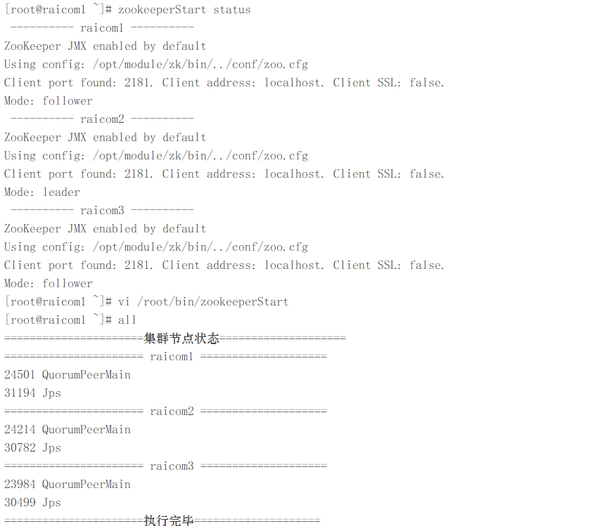

#### raicom-Zookeeper分布式部署

---

##### **前置环境** 

- Linux-CentOS7操作系统 -- raicom1（10.1.27.142）
- Linux-CentOS7操作系统 -- raicom2（10.1.27.144）
- Linux-CentOS7操作系统 -- raicom3（10.1.27.146）
- SSH远程连接工具 -- FinalShell
- Java环境 -- jdk1.8_341
- zookeeper3.9.0软件包

##### 1.1 Zookeeper文件配置

cd到zookeeper的根目录之后，进入`./conf`目录中：

```sh
cp zoo_sample.cfg zoo.cfg 
vi zoo_cfg
```

更改以下配置项

```properties
dataDir=/opt/module/zk/data
# 添加以下内容
server.1=raicom1:2888:3888
server.2=raicom2:2888:3888
server.3=raicom3:2888:3888
```

分发zoo.cfg文件

```sh
>scp -r /opt/module/zk/conf/zoo.cfg root@raicom2:/opt/module/zk/conf
>scp -r /opt/module/zk/conf/zoo.cfg root@raicom3:/opt/module/zk/conf
```

##### 1.2 Zookeeper缓存目录配置

根据在zoo.cfg文件中所配置的`dataDir`属性来配置缓存目录，在zookeeper根目录中创建data目录，**执行以下命令：**

```sh
mkdir /opt/module/zk/data
cd /opt/module/zk/data
echo <myid> > myid
```

> [!NOTE]
>
> echo <myid> 中的myid是zoo.cfg文件内容中所配置的每台主机在集群中的唯一id，
>
> 例如：
>
> server.1=raicom1:2888:3888
> server.2=raicom2:2888:3888
> server.3=raicom3:2888:3888
>
> 所以在raicom1主机上执行的命令就是echo 1 > myid

>  [!CAUTION]
>
> ***1.2节操作必须根据note中所说单独配置！！***

##### 1.3 启动zookeeper集群

前部分环节配置完成后现在开始启动zookeeper集群，需要三台分别启动，**启动命令如下：**

```sh
zkServer.sh start
```

启动后使用jps和`zkServer.sh status`指令检查启动是否成功，以下情况为启动完成：

> [!CAUTIOn]
>
> 我使用的shell脚本直接检查三台机器的启动情况，**内容如下**：
>
> #!/bin/bash
>
> case $1 in
> "start") {
>         for i in raicom1 raicom2 raicom3
>         do
>                 echo " ---------- $i ----------"
>                 ssh $i "source /etc/profile;/opt/module/zk/bin/zkServer.sh start"
>         done
> };;
> "stop") {
>         for i in raicom1 raicom2 raicom3
>         do
>                 echo " ---------- $i ----------"
>                 ssh $i "source /etc/profile;/opt/module/zk/bin/zkServer.sh stop"
>         done
> };;
> "status") {
>         for i in raicom1 raicom2 raicom3
>         do
>                 echo " ---------- $i ----------"
>                 ssh $i "source /etc/profile;/opt/module/zk/bin/zkServer.sh status"
>         done
> };;
>  esac



---

**Zookeeper集群部署完毕！**
