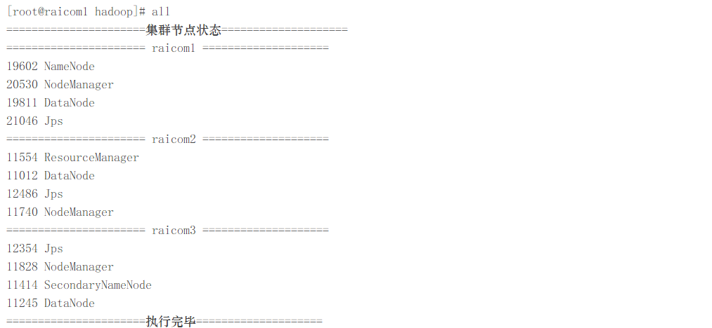
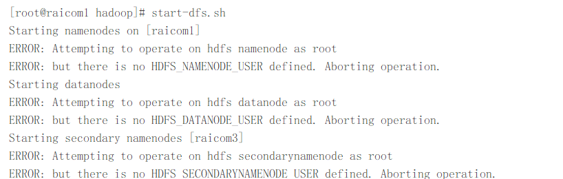
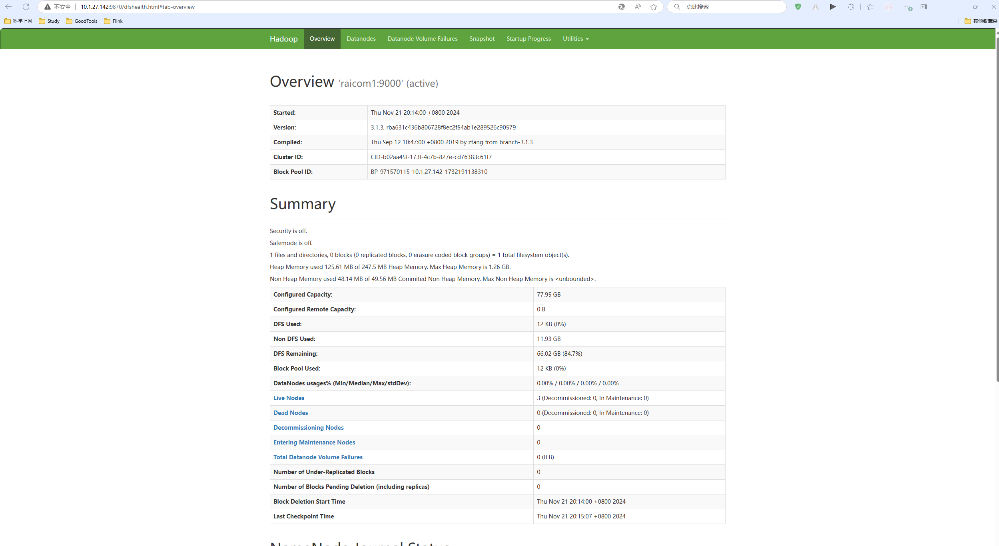
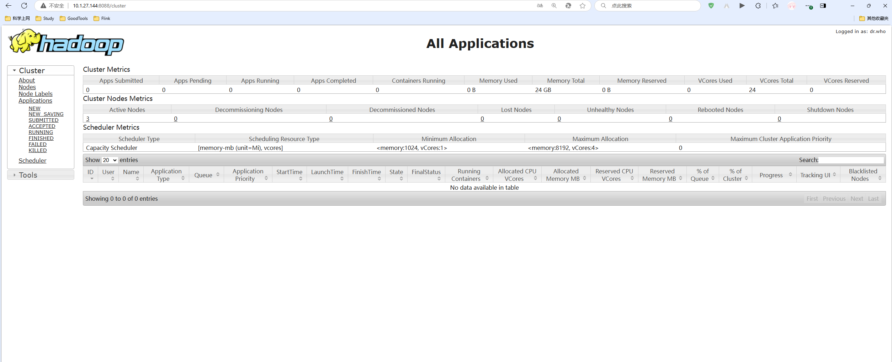

#### raicom-Hadoop分布式部署

---

##### 前置环境

- Linux-CentOS7操作系统 -- raicom1（10.1.27.142）
- Linux-CentOS7操作系统 -- raicom2（10.1.27.144）
- Linux-CentOS7操作系统 -- raicom3（10.1.27.146）
- SSH远程连接工具 -- FinalShell
- Java环境 -- jdk1.8_341
- hadoop3.1.3软件包

##### 1.1 hadoop基础文件配置

首先需要进入到hadoop根目录中，然后进入./etc/hadoop中开始编辑文件

> [!CAUTION]
>
> 编辑以下内容时如果文件类型是xml文件，必须把配置项写在<configuration></configuration>标签中

###### 1.1.1 core-site.xml文件

编辑core-site.xml文件后添加以下内容：

```xml
	<property>
         <!--配置hdfs的通信地址-->
		<name>fs.defaultFS</name>
		<value>hdfs://raicom1:9000</value> 
	</property>
	<property>
         <!--配置hadoop的临时数据存储目录-->
		<name>hadoop.tmp.dir</name>
		<value>/opt/module/hadoop/tmp</value>
	</property>
	<property>
        <!--配置登录hdfs网页静态登录用户为root-->
		<name>hadoop.http.staticuser.user</name>
		<value>root</value>
	</property>
```

###### 1.1.2 hdfs-site.xml文件

编辑hdfs-site.xml文件后添加以下内容：

```xml
	<!--namenode web端访问地址-->
	<property>
		<name>dfs.namenode.http-address</name>
		<value>raicom1:9870</value>
	</property>
	<!--secondarynamenode web端访问地址-->
	<property>
		<name>dfs.namenode.secondary.http-address</name>
		<value>raicom3:9868</value>
	</property>
	<property>
		<name>dfs.webhdfs.enabled</name>
		<value>true</value>
	</property>
    <property>
        <name>dfs.replication</name>
        <value>3</value>
    </property>
```

###### 1.1.3 yarn-site.xml文件

编辑yarn-site.xml文件后添加以下内容：

```xml
	<!--指定MR走shuffle-->
	<property>
		<name>yarn.nodemanager.aux-services</name>
		<value>mapreduce_shuffle</value>
	</property>
	<!--指定resourcemaneger的地址-->
	<property>
		<name>yarn.resourcemanager.hostname</name>
		<value>raicom2</value>
	</property>
	<!--yarn执行MapReduce任务时的classpath-->
	<property>
        <name>yarn.application.classpath</name> <value>/opt/module/hadoop/etc/hadoop:/opt/module/hadoop/share/hadoop/common/lib/*:/opt/module/hadoop/share/hadoop/common/*:/opt/module/hadoop/share/hadoop/hdfs:/opt/module/hadoop/share/hadoop/hdfs/lib/*:/opt/module/hadoop/share/hadoop/hdfs/*:/opt/module/hadoop/share/hadoop/mapreduce/lib/*:/opt/module/hadoop/share/hadoop/mapreduce/*:/opt/module/hadoop/share/hadoop/yarn:/opt/module/hadoop/share/hadoop/yarn/lib/*:/opt/module/hadoop/share/hadoop/yarn/*</value>
</property>
```

###### 1.1.4 mapred-site.xml文件

编辑mapred-site.xml文件后添加以下内容：

```xml
	<!--指定mapreduce程序运行在yarn上-->
	<property>
		<name>mapreduce.framework.name</name>
		<value>yarn</value>
	</property>
```

###### 1.1.5 workers文件配置

编辑workers文件，删除初始的localhost后添加以下内容：

> raicom1
> raicom2
> raicom3

上述文件配置完成之后，然后分别在hadoop-env.sh， yarn-env.sh，mapred-env.sh中添加一行JAVA_HOME的环境变量

> export JAVA_HOME=/opt/module/jdk

###### 1.1.6 分发配置文件

开始分发文件，使用以下命令：

> scp -r /opt/module/hadoop/etc/hadoop/ root@raicom2:/opt/module/hadoop/etc/
>
> scp -r /opt/module/hadoop/etc/hadoop/ root@raicom3:/opt/module/hadoop/etc/

确认分发成功之后，配置文件部分完成

##### 1.2启动Hadoop分布式集群

初次启动Hadoop集群之前需要在主节点上进行格式化namenode操作，使用如下命令：

> hdfs namenode -format

> [!CAUTION]
>
> **注意：格式化 NameNode，会产生新的集群 id，导致 NameNode 和 DataNode 的集群 id 不一致，集群找不到已往数据。如果集群在运行过程中报错，需要重新格式化 NameNode 的话，一定要先停 止 namenode 和 datanode 进程，并且要删除所有机器的 data 和 logs 目录，然后再进行格式化。**

格式化成功接下来使用如下命令启动集群

> start-dfs.sh
>
> raicom2:start-yarn.sh

启动后查看节点信息出现如下结果则为启动成功：



如果启动时控制台打印如下信息，**则需要进行权限配置**：



**解决方式**

在你解压的hadoop文件中的sbin文件中
vi进去并编辑start-dfs.sh与stop-dfs.sh

```properties
HDFS_DATANODE_USER=root
HDFS_DATANODE_SECURE_USER=hdfs 
HDFS_NAMENODE_USER=root 
HDFS_SECONDARYNAMENODE_USER=root
```

vi进去并编辑start-yarn.sh与stop-yarn.sh

```properties
YARN_RESOURCEMANAGER_USER=root
HADOOP_SECURE_DN_USER=yarn
YARN_NODEMANAGER_USER=root
```

##### 1.3 web端查看

在浏览器输入10.1.27.142:9870出现以下页面：



在浏览器输入10.1.27.144:8088出现以下页面：



---

**Hadoop完全分布式部署完毕！**
