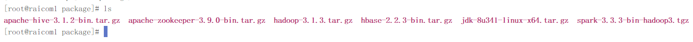
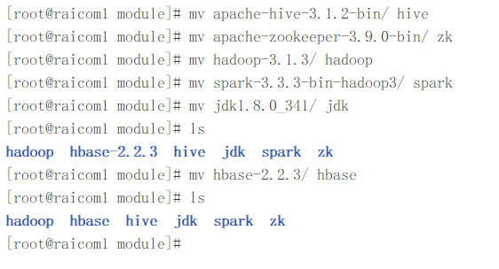
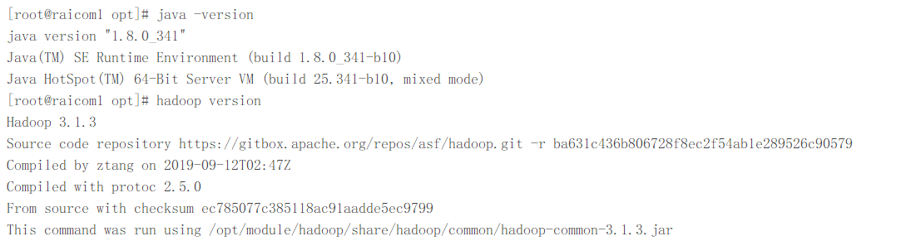

##### raicom-集群软件安装

---

###### **前置环境**

- Linux-CentOS7操作系统 -- raicom1（10.1.27.142）
- Linux-CentOS7操作系统 -- raicom2（10.1.27.144）
- Linux-CentOS7操作系统 -- raicom3（10.1.27.146）
- SSH远程连接工具 -- FinalShell

**所需软件包：**

- apache-hive-3.1.2-bin.tar.gz
- apache-zookeeper-3.9.0-bin.tar.gz
- spark-3.3.3-bin-hadoop3.tgz
- hadoop-3.1.3.tar.gz
- jdk-8u341-linux-x64.tar.gz
- hbase-2.2.3-bin.tar.gz

###### 1.1 解压软件包

软件所在位置`/opt/package`



安装目标路径：`/opt/module`

**解压所有软件包**

```sh
>tar -zxvf <软件包名称> -C ../module/
```

解压后更改目录名为简单名称，方便后续操作



**分发软件包到其他主机**

```sh
> scp -r /opt/module/ root@<主机名orIP>:/opt/
```

###### 1.2 配置系统环境(统一)

编辑/etc/profile文件，配置环境变量，**添加以下内容：**

```properties
export JAVA_HOME=/opt/module/jdk
export PATH=$JAVA_HOME/bin:$PATH

export HIVE_HOME=/opt/module/hive
export PATH=$HIVE_HOME/bin:$PATH

export SPARK_HOME=/opt/module/spark
export PATH=$SPARK_HOME/bin:$PATH

export HBASE_HOME=/opt/module/hbase
export PATH=$HBASE_HOME/bin:$PATH

export HD_HOME=/opt/module/hadoop
export PATH=$HD_HOME/bin:$PATH
export PATH=$HD_HOME/sbin:$PATH

export ZK_HOME=/opt/module/zk
export PATH=$ZK_HOME/bin:$PATH
```

**重载环境变量**

```sh
>source /etc/profile
>scp -r /etc/profile root@raicom2:/etc/
>scp -r /etc/profile root@raicom3:/etc/
```

检测配置环境是否成功



---

**集群初步配置完成**！